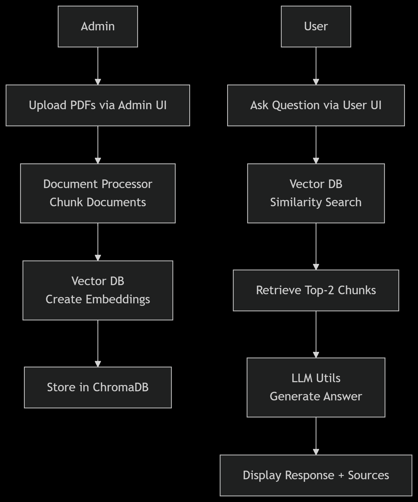
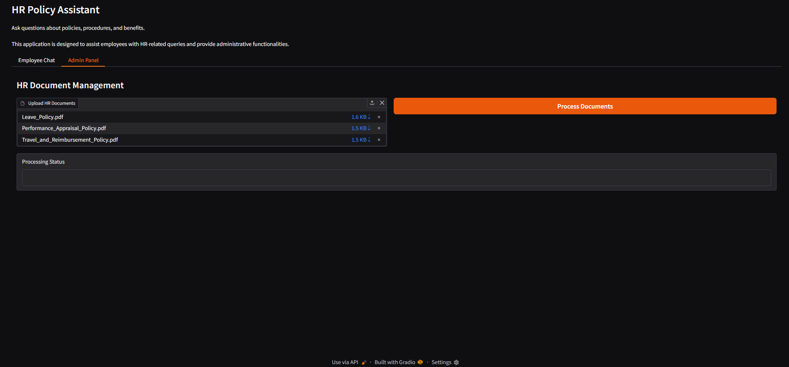
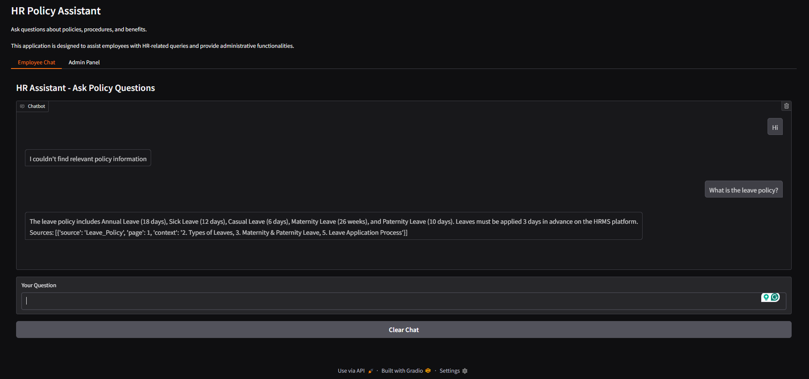

# HR Policy Chatbot Assistant

## Table of Contents
- [Overview](#overview)
- [System Architecture](#system-architecture)
- [Features](#features)
- [Installation](#installation)
- [Configuration](#configuration)
- [Usage](#usage)
- [Modules Overview](#modules-overview)
- [Troubleshooting](#troubleshooting)
- [License](#license)

## Overview

The HR Policy Chatbot Assistant is an AI-powered solution designed to help new employees quickly find answers to HR-related questions. The application uses open-source tools and large language models to provide accurate responses based on company policy documents.

**Key Components:**
- Document management system for HR policies
- Natural language question answering
- Source citation for transparency
- Separate interfaces for administrators and employees

## System Architecture


**Workflow Explanation:**
1. **Admin Workflow**:
   - Upload HR policy PDFs through admin interface
   - System processes documents into text chunks
   - Generates embeddings using BAAI/llm-embedder model
   - Stores embeddings in ChromaDB vector database

2. **User Workflow**:
   - Employee asks natural language question
   - System embeds the question
   - Performs similarity search in ChromaDB
   - Retrieves top 2 relevant policy chunks
   - Generates answer using Llama3-70B via Groq API
   - Displays answer with source citations

## Installation

### Prerequisites
- Python 3.9+
- Groq API key (free at [Groq Cloud](https://console.groq.com/))
- PDF policy documents

### Setup Instructions

1. Clone the repository:
```bash
git clone https://github.com/SaurabhZodex/NewCold-Assessment.git
cd NewCold-Assessment
```

2. Create and activate virtual environment:
```bash
python -m venv venv
venv\Scripts\activate
```

3. Install dependencies:
```bash
pip install -r requirements.txt
```

4. Create data directory and add policy PDFs:
```bash
mkdir data
# Place your PDFs in the data/ directory
```

6. Run the application:
```bash
python app.py
```

7. Access the application at [http://localhost:7860](http://localhost:7860)

## Configuration

Edit `config.py` to customize the application:

## Usage

### Admin Interface
1. Access the **Admin Panel** tab
2. Upload HR policy PDFs using the file uploader
3. Click "Process Documents"
4. View processing status
5. Documents are now available for employee queries



### Employee Interface
1. Access the **Employee Chat** tab
2. Ask questions in natural language
3. View answers with source citations
4. Start new conversations with the "Clear Chat" button



